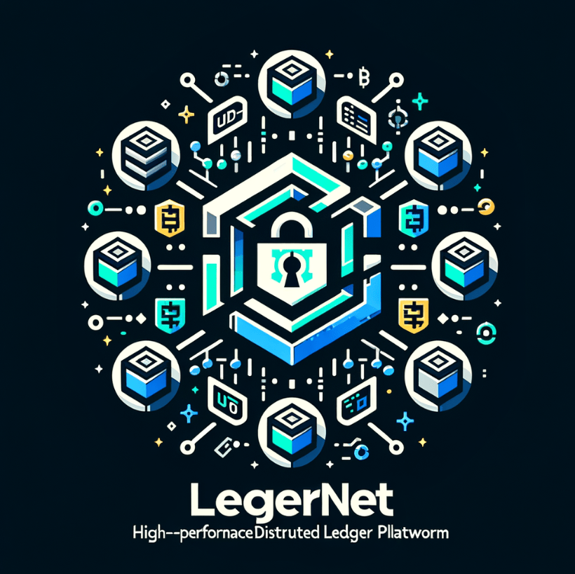

<p align="center">
  <picture>
    <source srcset="./assets/logo.png">
     <!-- Logo height increased from 60px to 120px -->
  </picture>
  <p align="center">
    Build fast, secure, and scalable decentralized applications with LedgerNet.
    <br />
    <br />
  </p>
</p>

# LedgerNet

LedgerNet is a high-performance distributed ledger platform that leverages the UTXO model and ED25519 cryptography for secure and efficient transactions. The platform uses Protocol Buffers for compact data serialization and gRPC for low-latency communication between nodes. LedgerNet's consensus mechanism is based on proof-of-stake (POS), which provides a more sustainable and decentralized alternative to proof-of-work (POW).

## Features

- UTXO model for fast and efficient transactions
- ED25519 cryptography for robust security
- Protocol Buffers for compact data serialization
- gRPC for low-latency communication between nodes
- Proof-of-stake (POS) consensus mechanism
- Modular and extensible architecture

## Getting Started

### Prerequisites

- Go 1.16 or later
- Protocol Buffers compiler (protoc) 3.13.0 or later

### Building and Running

1. Clone the LedgerNet repository:

```bash
git clone https://github.com/your-username/ledgernet.git
```
